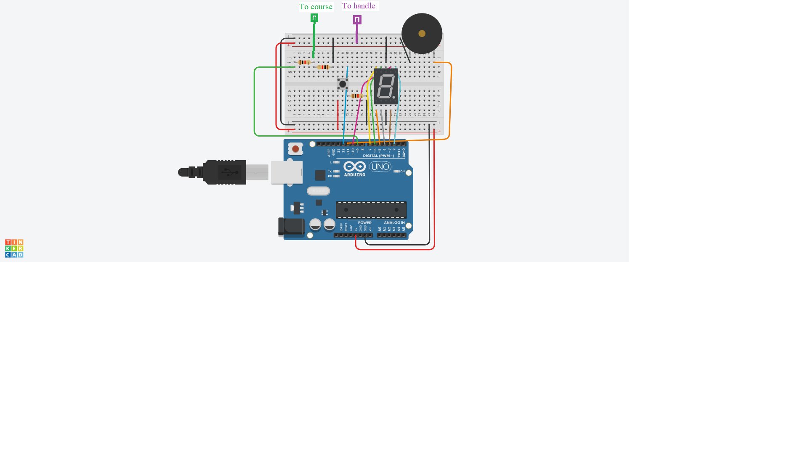

# BuzzWireGame

A challenging game which involves guiding a metal loop along a serpentine length of wire without touching the loop to the wire. The loop and wire are connected to a power source in such a way that, if they touch, they form a closed electric circuit. The circuit is connected to a sound-emitting device, so that when the loop and the wire touch, the sound-emitting device will make a buzzing noise.

## Circuit schematic 

## Requirements
  ***Hardware***
  * One Arduino Uno Booard
  * One breadboard
  * One data cable
  * One metal coat hanger
  * One piezo buzzer
  * One seven segment display
  * Resistors
  * One button
  * Male-to-male hookup wires
  
  ***Software***
  * Arduino IDE
  
## User Manual
  * Install Arduino IDE if you don't have it installed on your PC
  * Download the BuzzWireGame.ino file
  * Open the BuzzWireGame.ino file in Arduino IDE
  * Remake the circuit as show in the schematic
  * Verify and Upload the code
  * Now try to get on the other side with 0 mistakes
  * You can see the number of the mistakes you made on the seven segment display and you can reset the counter by pressing the button
  
## Bibliography
  * https://www.makeuseof.com/tag/make-buzz-wire-game-arduino/
  * https://en.wikipedia.org/wiki/Wire_loop_game
